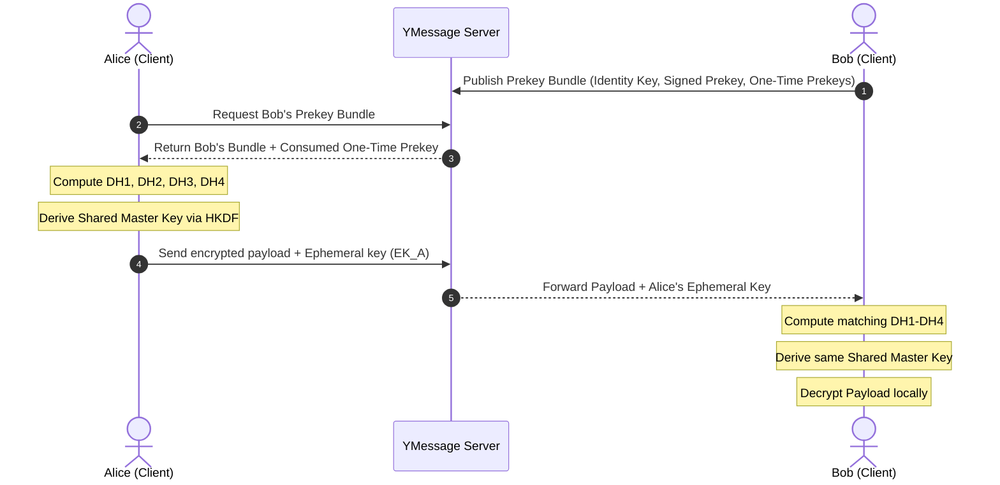

# YMessage
> Private. Fast. Beautiful.

YMessage is a production-ready, secure, and beautiful messaging platform. Inspired by the visual aesthetics of Apple's iMessage, YMessage is engineered to support millions of concurrent users. It features end-to-end encryption (Signal Protocol principles), real-time WebSockets, distributed multi-device synchronization, media compression, and administrative controls.

---

## 1. Feature Checklist

- [x] **Authentication:** Email/Username login, device session registration, automatic cryptographic prekey bundle generation, token rotation (JWT & Refresh).
- [x] **End-to-End Encryption:** Local ECDH P-256 key exchanges (X3DH), shared secret derivation via HKDF, and AES-256-GCM client-side encryption.
- [x] **Real-Time Sync:** Concurrency WebSocket hub, distributed server scaling via Redis Pub/Sub, and fallback in-memory routing.
- [x] **Rich Messaging:** Typing indicators, reactions, read receipts, and delivery checkmarks.
- [x] **Media Processing:** Progressive upload, image compression, and pure-Go bilinear thumbnail scaling.
- [x] **Admin Dashboard:** Telemetry metrics (Memory alloc, GC count, Goroutines), user suspend directory, and content moderation tools.
- [x] **Infrastructure as Code:** Terraform scripts for AWS (VPC, Subnets, RDS, ElastiCache Redis, S3).
- [x] **Orchestration:** Multi-stage Dockerfiles, Docker Compose files, Nginx load balancer reverse proxy, and Kubernetes rolling updates.

---

## 2. Directory Structure

```text
YMessage/
├── .github/workflows/        # CI/CD pipelines
│   └── ci.yml                # GitHub Actions automated build, lint, and test validation
├── backend/                  # Go (Gin, GORM, WebSocket)
│   ├── cmd/server/main.go    # Application gateway bootstrap and CORS configurations
│   ├── internal/
│   │   ├── admin/            # Telemetry metrics and moderator actions (Ban, Delete)
│   │   ├── auth/             # JWT auth middleware and session/profile handlers
│   │   ├── chat/             # WS server, connection hub, and cursor-paginated messages
│   │   ├── crypto/           # E2EE prekeys bundle uploads & retrieval
│   │   ├── database/         # Database pools (Auto fallbacks: PostgreSQL -> SQLite)
│   │   ├── models/           # Shared database schema models (User, Device, Message)
│   │   └── media/            # S3 client, progressive uploads, and thumbnail generation
│   ├── Dockerfile            # Multi-stage optimized Docker packaging
│   └── go.mod                # Go module dependencies list
├── frontend/                 # Next.js React Web Client & Admin Panel (React/TS/Tailwind)
│   ├── pages/                # Next.js Pages (index, login, admin dashboard)
│   ├── components/           # Glassmorphic Tailwind UI bubbles
│   ├── styles/globals.css     # Tailwind directives, custom scrollbars, and glass effects
│   ├── utils/crypto.ts       # Subtle Web Crypto API E2EE client helpers (ECDH, AES-GCM)
│   └── Dockerfile            # Frontend compilation container
├── mobile/                   # Flutter App (Mobile & Desktop native client)
│   ├── lib/
│   │   ├── services/         # Pure-Dart cryptography E2EE & WebSockets
│   │   ├── views/            # Cupertino screens (Login, Chats list, Chat room)
│   │   └── main.dart         # CupertinoProvider bootstrap
│   └── pubspec.yaml          # Flutter package dependencies
├── mobile_rn/                # React Native Expo Go Mobile Client (SDK 54)
│   ├── App.tsx               # Main mobile client interface, WS sync, E2EE state
│   ├── app.json              # Expo application manifest configuration
│   ├── package.json          # Node modules config (React 19 / RN 0.81.5 compatible)
│   └── .npmrc                # Bypasses peer dependency conflicts (`legacy-peer-deps`)
├── docker/                   # Local orchestrations
│   ├── docker-compose.yml    #postgres, redis, backend, frontend, nginx gateway
│   └── Nginx.conf            # Route mapping, WebSocket connection upgrades
├── k8s/                      # Production cluster orchestration
│   └── ymessage-production.yaml # StatefulSets, PVC, Deployments, and Ingress routing
└── terraform/                # Infrastructure as Code
    ├── main.tf               # AWS VPC, Subnets, RDS database, ElastiCache, S3
    └── variables.tf          # Terraform configurations
```

---

## 3. Database Schema Models

YMessage uses GORM to automatically map, index, and migrate PostgreSQL and SQLite tables:

### 1. `User`
* `id`: `uuid` (Primary Key)
* `username`: `varchar(50)` (Unique Index)
* `email`: `varchar(100)` (Unique Index)
* `phone`: `varchar(20)` (Unique Index)
* `password_hash`: `varchar(255)`
* `display_name`: `varchar(100)`
* `status`: `varchar(50)` (online, offline, banned)
* `last_seen`: `datetime`

### 2. `Device`
* `id`: `uuid` (Primary Key)
* `user_id`: `uuid` (Foreign Key referencing `users.id`)
* `device_name`: `varchar(100)`
* `platform`: `varchar(50)` (ios, android, web, desktop)
* `identity_key`: `text` (ECDH P-256 Public Key)
* `refresh_token`: `varchar(255)`
* `token_expiry`: `datetime`

### 3. `Message`
* `id`: `uuid` (Primary Key)
* `sender_id`: `uuid` (Foreign Key referencing `users.id`)
* `receiver_id`: `uuid` (Nullable, for direct messages)
* `group_id`: `uuid` (Nullable, for group messages)
* `content_type`: `varchar(50)` (text, photo, file)
* `encrypted_payload`: `text` (Encrypted base64 payload concatenated with IV `ciphertext:iv`)
* `status`: `varchar(50)` (sent, delivered, read)
* `created_at`: `datetime`

---

## 4. End-to-End Encryption (E2EE) Protocol

The E2EE engine utilizes standard cryptographic principles based on ECDH P-256 curves, HKDF key derivation, and AES-256-GCM symmetric block ciphers:

### X3DH (Extended Triple Diffie-Hellman) Flow


* **AES-256-GCM Details:** Message payloads are encrypted with the derived symmetric key and a random 96-bit (12-byte) Initialization Vector (IV). The payload is sent to the backend as `ciphertext_b64:iv_b64`.

---

## 5. REST & WebSocket API Specification

### Authentication
* **`POST /api/auth/register`**
  - Body: `{ "username": "...", "email": "...", "password": "...", "display_name": "..." }`
* **`POST /api/auth/login`**
  - Body: `{ "username": "...", "password": "...", "platform": "web", "device_name": "...", "identity_key": "..." }`
  - Returns: `{ "access_token": "...", "refresh_token": "...", "device_id": "...", "user": { ... } }`
* **`POST /api/auth/refresh`**
  - Body: `{ "refresh_token": "..." }`
* **`GET /api/auth/profile`**
  - Returns the logged-in user profile, active devices, and E2EE parameters.

### E2EE Prekeys
* **`POST /api/crypto/prekey`**
  - Uploads E2EE public keys.
  - Body: `{ "identity_key": "...", "signed_prekey": "...", "signed_prekey_id": 1, "signature": "...", "one_time_prekeys": [{"key_id": 101, "key_val": "..."}] }`
* **`GET /api/crypto/prekey/:userId`**
  - Fetches the public bundle of a partner to initiate an E2EE session. Marks a single One-Time Prekey as consumed.

### Chat & WebSocket History
* **`GET /api/chat/chats`**
  - Returns a list of active chats, last message preview, and unread counts.
* **`GET /api/chat/messages`**
  - Fetches cursor-paginated messages of a chat.
  - Query: `?chat_id=UUID&cursor=ISO_TIMESTAMP`
* **`GET /api/chat/ws`**
  - Upgrade route. Upgrades HTTP to WebSocket protocol.
  - WS Actions:
    * `{ "type": "message", "payload": { "receiver_id": "...", "content_type": "text", "encrypted_payload": "..." } }`
    * `{ "type": "typing", "payload": { "chat_id": "...", "is_typing": true } }`
    * `{ "type": "receipt", "payload": { "message_ids": ["..."], "status": "read" } }`

---

## 6. Running the Project

### Local Quickstart (Zero Configuration)
The backend dynamically falls back to **SQLite** and **in-memory WebSocket routing** if PostgreSQL and Redis environment variables are absent.

1. **Run the Go Backend:**
   ```bash
   cd backend
   go run ./cmd/server
   # Starts listening on http://localhost:8080
   ```
2. **Run the Next.js Frontend:**
   ```bash
   cd frontend
   npm install
   npm run dev
   # Access UI at http://localhost:3000
   ```
3. **Run the Expo Go Mobile App:**
   ```bash
   cd mobile_rn
   npm install
   npx expo start
   ```
   * Scan the QR code displayed in the terminal using your smartphone's camera (iOS) or the **Expo Go** app (Android).
   * Input the host IP into the login screen of the app: **`clean-baths-share.loca.lt`** (or your machine's local IP address).

### Production Docker Stack
Start the databases, Redis caching, reverse proxy, frontend, and backend services under a unified network:
```bash
docker-compose -f docker/docker-compose.yml up --build
```
Once healthy:
* Next.js Frontend: `http://localhost`
* Go Backend Gateway: `http://localhost/api`

---

## 7. Cloud Deployment & Orchestration

### Kubernetes Cluster
Deploy the unified container configurations to Kubernetes:
```bash
kubectl apply -f k8s/ymessage-production.yaml
```
This deploys:
- PostgreSQL PVC (10Gi storage) and StatefulSet.
- Redis caching deployment.
- Rolling update deployments for the Go backend API and Next.js frontend pods.
- Ingress routing rules proxying web traffic and WebSocket handshakes.

### Terraform IaC
Initialize and deploy network VPCs, RDS instances, cache segments, and ECS configurations to AWS:
```bash
cd terraform
terraform init
terraform plan -out=tfplan
terraform apply tfplan
```
